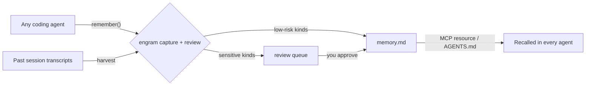

Every memory in Engram passes through three distinct phases before it can influence an agent: **capture**, **review**, and **recall**. Capture turns raw information into a typed candidate. Review routes that candidate to either auto-append or human approval. Recall surfaces only trusted, fresh memories to agents that need them. Understanding this pipeline tells you exactly where a fact lives at any moment and what it takes to move it forward.

---

## Lifecycle overview



The two entry points — `remember()` and `harvest` — both produce **pending candidates**. The bridge then inspects each candidate's risk tier and routes it appropriately. Only promoted memories reach agents.

---

## Phase 1 — Active capture (`remember`)

Active capture happens when an agent explicitly calls the `remember` tool during a session. You, or a tool you invoke, assert a fact directly.

```bash
# From any agent or shell
engram remember "I prefer pnpm over npm" --kind tooling
engram remember "Monthly cloud budget is \$200" --kind fiscal
```

Each call:
1. Validates the fact text and `kind` against the schema.
2. Assigns a stable `id` (e.g. `mem-0042`).
3. Writes the candidate to `queue/<id>.json` with `status: pending` and `learned_by: remember`.
4. Sets `confidence` based on the `--confidence` flag (default `0.5`) or the kind's baseline.

<Note>
Active captures from `remember` do **not** bypass review for curated kinds. A `remember --kind fiscal` call still lands in the review queue, not in `memory.md`, until you confirm it.
</Note>

---

## Phase 2 — Passive harvest

Passive harvest extracts memories from conversation transcripts automatically, without any explicit agent call. The harness feeds a past session transcript through the extractor LLM, which identifies candidate facts and assigns kinds.

```bash
engram harvest session-2026-01-15.txt --harness codex
```

The extractor pipeline:
1. Chunks the transcript into context windows.
2. Asks the extractor LLM to identify memorable facts and their kinds.
3. Runs deduplication against existing promoted memories.
4. Filters out trivia (ephemeral values, one-off calculations, pleasantries).
5. Stages surviving candidates in `queue/` with `learned_by: harvest` and a lower baseline confidence.

<Accordion title="Deduplication logic">
Before staging a harvested candidate, Engram runs it through the dedup engine using token overlap and **precision token** matching (identifiers, dates, monetary amounts).

The dedup result is one of:

- **`duplicate`** — An identical or near-identical promoted memory already exists. The candidate is discarded silently.
- **`conflict`** — A promoted memory covers the same subject but with a different value (e.g., two different budget figures). The candidate is **always escalated to tier 3** (curated/review), regardless of its kind's normal tier. A conflict flag is attached so you can decide which version is correct.
- **`distinct`** — No overlap detected. The candidate proceeds through normal tier routing.
</Accordion>

<Warning>
Conflicts are **never** auto-appended, even for tier-1 kinds like `tooling` or `preference`. If the extractor finds a second "preferred package manager" fact that contradicts an existing one, both land in the review queue so you can pick the authoritative value.
</Warning>

---

## Phase 3 — Bridge routing (`sync --apply`)

The bridge is the step that moves candidates from `queue/` into the active store. Run it after one or more captures:

```bash
engram sync --apply
```

For each pending candidate the bridge:

1. Re-computes the `risk_tier` using the kind and conflict flag.
2. Routes based on tier:

| Tier | Kinds | Action |
|---|---|---|
| **1 — Auto-append** | `preference`, `tooling`, `project`, `infra` | Written directly to `memory-log.md`; frontmatter updated |
| **2 — Registry** | *(elevated tier-1 with minor metadata concerns)* | Added to `memory.md` frontmatter; no queue dwell |
| **3 — Curated** | `identity`, `fiscal`, `people`, `constraint`, `location`, `health`, any conflict | Stays in `queue/`; human review required |

3. Sets `dest` on the memory record to indicate where it was written.
4. Appends an entry to `audit.jsonl` with a timestamp and undo token.

<Tip>
Run `engram sync --dry-run` first to preview what the bridge would do without making any changes to the store.
</Tip>

---

## Phase 4 — Review queue

Tier-3 memories sit in `queue/<id>.json` until you explicitly act on them. Use the review commands to work through the queue:

```bash
# List everything awaiting review
engram review list

# Inspect a single candidate
engram review show mem-0007

# Approve and promote
engram promote mem-0007 --confirm

# Decline
engram reject mem-0007
```

On `promote --confirm`:
- The memory moves from `queue/` to `queue/_done/`.
- `status` is set to `promoted`.
- `last_verified` is set to today's date.
- The frontmatter in `memory.md` is updated atomically; a `.bak/` snapshot is written first.
- An audit entry is appended to `audit.jsonl`.

On `reject`:
- `status` is set to `rejected`.
- The record moves to `queue/_done/` for traceability.
- Nothing is written to `memory.md`.

<Note>
Rejected memories are not deleted — they remain in `queue/_done/` with their full audit trail. If you reject something by mistake, `engram undo` can reverse the last operation using the undo token from `audit.jsonl`.
</Note>

---

## Phase 5 — Recall

Recall is the read side of the pipeline. Agents access memories through two channels:

**MCP resource** — Engram exposes `memory://facts` as an MCP resource. Any MCP-compatible agent (Claude, Cursor, Windsurf, etc.) can read the current set of promoted, fresh memories without any Engram-specific integration.

**AGENTS.md injection** — `engram sync --apply` regenerates the Markdown body in `memory.md` and can write a formatted block into your repo's `AGENTS.md` (or `CLAUDE.md` / `CURSOR.md`) so agents receive memories as part of their system context.

```bash
engram sync --apply --inject AGENTS.md
```

During recall, Engram filters the promoted memory set to exclude:

- Memories with `status: rejected` or `status: pending`.
- Memories where `is_stale(memory, today)` is `true` — i.e., `learned_at + decay < today` and `last_verified` has not reset the clock.

Only **promoted and fresh** memories are surfaced. Stale memories remain in the store but are invisible to agents until you re-verify them with `engram doctor --reverify`.

<Accordion title="Full status transition table">
| From | To | Trigger |
|---|---|---|
| *(none)* | `pending` | `remember`, `harvest`, or `import` |
| `pending` | `promoted` | `engram promote <id> --confirm` or tier-1/2 auto-append |
| `pending` | `rejected` | `engram reject <id>` |
| `promoted` | `stale` | `learned_at + decay < today` (checked on every sync/recall) |
| `stale` | `promoted` | `engram promote <id> --confirm` or `doctor --reverify` |
| `rejected` | *(terminal)* | — |
</Accordion>
